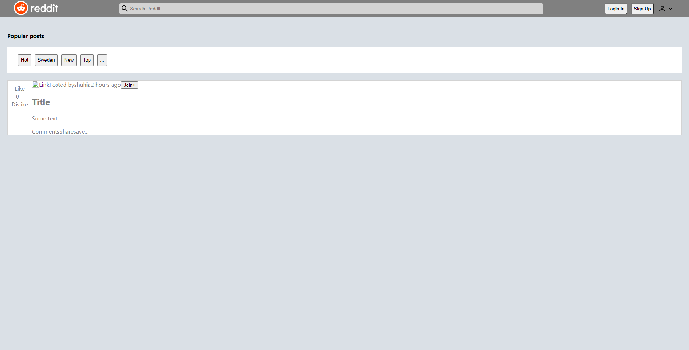

# Project Name

> Link to project deployed with netlify.
> Live demo [_here_](https://shuhia-reddit.netlify.app/). <!-- If you have the project hosted somewhere, include the link here. -->

## Table of Contents

- [General Info](#general-information)
- [Technologies Used](#technologies-used)
- [Features](#features)
- [Screenshots](#screenshots)
- [Setup](#setup)
- [Usage](#usage)
- [Project Status](#project-status)
- [Room for Improvement](#room-for-improvement)
- [Acknowledgements](#acknowledgements)
- [Contact](#contact)
<!-- * [License](#license) -->

## General Information

- Provide general information about your project here.
- What problem does it (intend to) solve?
- What is the purpose of your project?

### Purpose of this project

- To complete one of the big projects in the frontend course
- To use everything that we have learned so far. For example: React and Redux.
<!-- You don't have to answer all the questions - just the ones relevant to your project. -->

## Technologies Used

- Redux - <!-- TODO -->
- ReactJS - V17.0.2
- HTML - <!-- TODO -->
- CSS - <!-- TODO -->
- JavaScript - <!-- TODO -->

## Features

List the ready features here:

- Search for a post

## Screenshots

Version 1.0

Version 1.1

## Setup

What are the project requirements/dependencies? Where are they listed? A requirements.txt or a Pipfile.lock file perhaps? Where is it located?

Proceed to describe how to install / setup one's local environment / get started with the project.

## Usage

### Search

- Search posts

### Filter

- Filter posts

### Interact with post

- Write a comment
- Like or dislike

`write-your-code-here`

## Project Status

Project is: _in progress_

## Room for Improvement

Include areas you believe need improvement / could be improved. Also add TODOs for future development.

Room for improvement:

- Add a css framework. For example: [Materialize](https://materializecss.com/), [Bootstrap](https://getbootstrap.com/) or [Tailwind](https://tailwindcss.com/)
- Add React framework: [NextJS](https://nextjs.org/)

To do:

- Login authentication

## Acknowledgements

This section provides links to where we got inspiration from.

- This project was inspired by [Reddit](https://www.reddit.com/)
- This project was based on [this tutorial](https://www.codecademy.com/paths/front-end-engineer-career-path/tracks/fecp-react-and-redux-portfolio-project/modules/fecp-reddit-client/kanban_projects/reddit-client).
- Many thanks to Codecademy and all collaborators.

## Contact

Created by [Alex On](https://www.linkedin.com/in/alex-on-0a08b8107/) (LinkedIn profile) - feel free to contact me!

Created by [@flynerdpl](https://www.flynerd.pl/) - feel free to contact me!

Created by [@flynerdpl](https://www.flynerd.pl/) - feel free to contact me!

<!-- Optional -->
<!-- ## License -->
<!-- This project is open source and available under the [... License](). -->

<!-- You don't have to include all sections - just the one's relevant to your project -->
